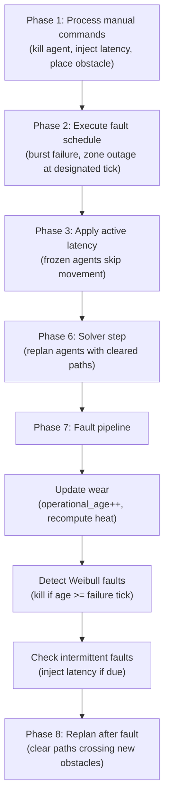
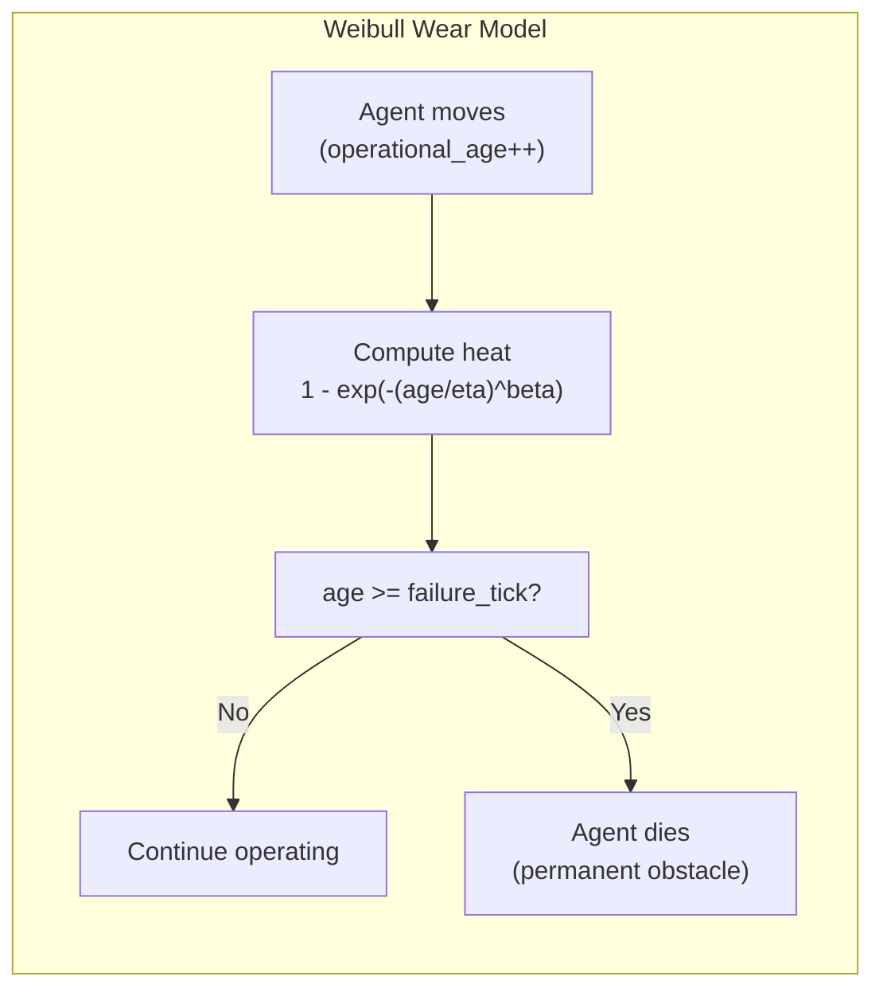
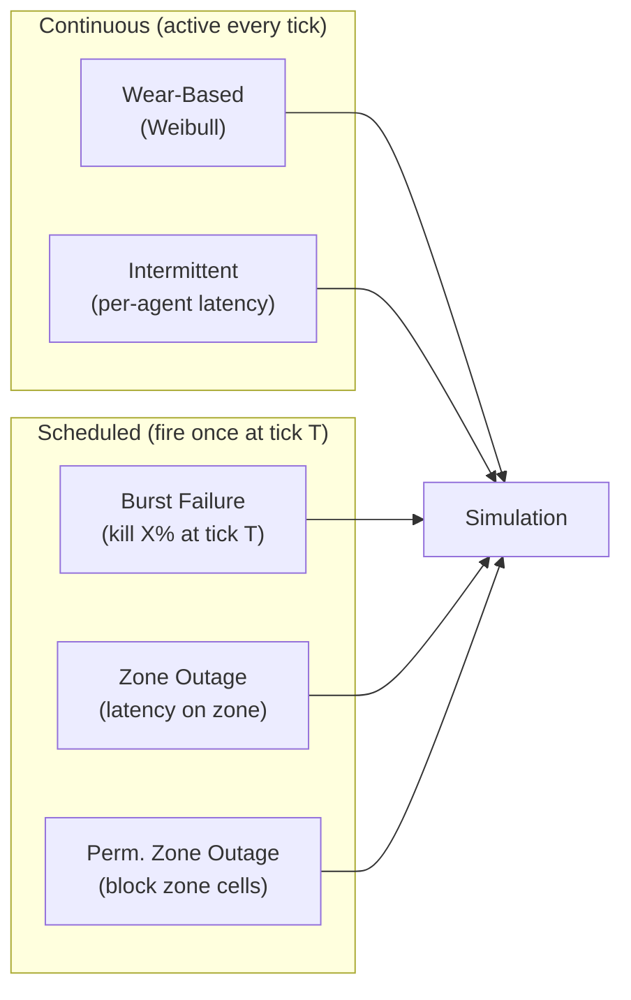
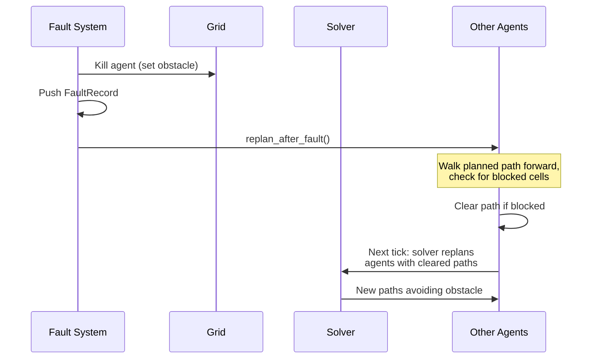

# Fault System

How MAFIS breaks things — and how agents respond.

MAFIS injects faults to measure how multi-agent systems degrade, recover, and adapt. The fault system has three layers: a **wear model** (gradual degradation), **scheduled events** (sudden disruptions), and **manual injection** (interactive testing).

---

## The Pipeline

Every tick, faults are processed in this order:



Faults that kill agents or create obstacles (Phases 1-2, 7b) trigger replanning (Phase 8) — any agent whose planned path crosses a newly blocked cell gets its path cleared, and the solver provides a new one next tick.

---

## Wear Model (Weibull)

Agents accumulate **operational age** — a counter that increments by 1 each tick the agent actually moves (Wait actions don't count). This age feeds into the Weibull CDF to produce a **heat** value (0 to 1) that represents stress level.

### The formula

```
heat = operational_age / failure_tick
```

- `operational_age` = movement ticks accumulated so far
- `failure_tick` = pre-sampled Weibull failure threshold for this agent
- `heat` = individual progress toward death (0 → 1)

This is a **linear progress indicator**, not the Weibull CDF. An agent at `heat = 0.8` has consumed 80% of its lifetime. The Weibull distribution governs *where* the failure tick is set — the heat display itself is just normalized age.

### How failure works

Failure ticks are **pre-sampled at initialization**, not checked probabilistically each tick:

```
failure_tick = eta * (-ln(U)) ^ (1/beta)    where U ~ Uniform(0,1)
```

Each agent gets a deterministic failure tick drawn from the Weibull distribution using the simulation's seeded RNG. When `operational_age >= failure_tick`, the agent dies. This makes failures fully deterministic — same seed, same failures.

### Weibull presets

Three presets calibrated to published AGV reliability data:

| Preset | Beta | Eta | MTTF | ~Dead at tick 500 | Based on |
|--------|------|-----|------|--------------------|----------|
| **Low** | 2.0 | 900 | ~800 ticks | ~27% | CASUN AGV, well-maintained fleet |
| **Medium** | 2.5 | 500 | ~445 ticks | ~63% | Canadian survey, 500-1000h MTBF |
| **High** | 3.5 | 150 | ~137 ticks | ~90% | Carlson & Murphy 2006, MTBF ~24h |

Custom `(beta, eta)` values are also supported.



---

## Fault Types

| Type | Duration | Effect | Trigger |
|------|----------|--------|---------|
| **Overheat** | Permanent | Agent dies, becomes grid obstacle | Weibull wear model |
| **Latency** | Temporary (N ticks) | Agent frozen, path cleared, resumes after countdown | Intermittent model or manual |
| **Breakdown** | Permanent | Same as Overheat | Manual injection or schedule |

When an agent **dies**:
- `alive` set to false
- Position becomes a permanent obstacle on the grid
- Planned path cleared
- Removed from any queue slot
- Other agents in the same queue get rerouted (see [Task Lifecycle](../task-lifecycle/README.md))

When an agent gets **latency**:
- `latency_remaining` set to N ticks
- Path cleared every tick (forced to wait)
- Excluded from `used_goals` (doesn't block assignments)
- Automatically recovers when countdown reaches 0

---

## Fault Scenarios

Scenarios combine multiple fault types into realistic failure patterns.

| Scenario | Category | What happens |
|----------|----------|-------------|
| **Burst Failure** | Scheduled | Kill X% of random agents at tick T |
| **Wear-Based** | Continuous | Agents fail gradually via Weibull model |
| **Zone Outage** | Scheduled | Inject latency on all agents in the busiest zone for N ticks |
| **Intermittent** | Continuous | Random per-agent latency events (exponential inter-arrival) |
| **Permanent Zone Outage** | Scheduled | Block X% of cells in the busiest zone permanently |

### Combining scenarios

Multiple scenarios can run in a single simulation:



Rules:
- At most 1 Wear-Based and 1 Intermittent (continuous models)
- Multiple Burst/Zone events allowed (even on the same tick — percentages sum, capped at 100%)
- All types are combinable in one run

### Intermittent faults

Each agent independently samples its next fault time from an exponential distribution:

```
next_fault_tick = current_tick + Exp(1/mtbf)    capped at 10x mtbf
```

When the tick arrives, the agent gets a latency injection for `recovery_ticks` duration, then a new interval is sampled. This creates realistic bursty unavailability patterns.

---

## Fault Schedule

Scheduled events are stored as a list and fire once at their designated tick:

```rust
struct ScheduledEvent {
    tick: u64,              // when to fire
    action: ScheduledAction, // what to do
    fired: bool,            // prevents re-fire
}

enum ScheduledAction {
    KillRandomAgents(count),
    ZoneLatency { duration },
    ZoneBlock { block_percent },
}
```

The schedule supports deterministic replay — events replay identically on rewind because `fired` flags reset.

---

## Manual Injection

During a running simulation, you can inject faults interactively:

| Command | Effect |
|---------|--------|
| Kill agent (by index) | Immediate death + obstacle |
| Place obstacle (by cell) | Permanent wall |
| Inject latency (agent + duration) | Temporary freeze |

Manual faults are logged in `ManualFaultLog` for deterministic rewind replay. All faults (automatic, scheduled, manual) produce `FaultRecord` entries consumed by the metrics system.

---

## What happens after a fault



The replan happens with a 1-tick delay: the fault creates the obstacle, `replan_after_fault()` identifies affected agents and clears their paths, then the solver gives them new paths on the next tick's Phase 6.
