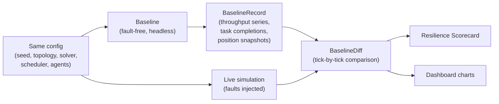
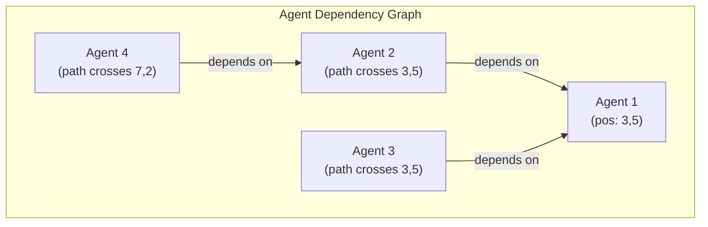
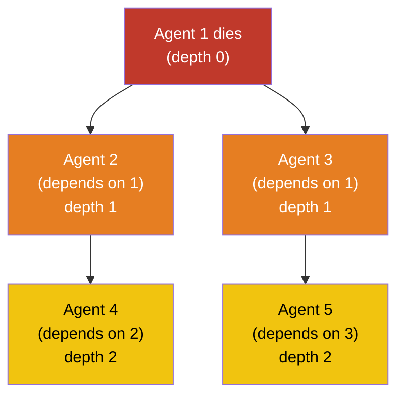
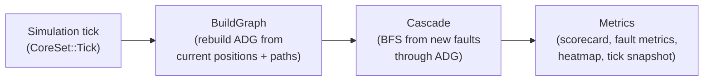

# Metrics & Analysis

How MAFIS measures resilience — differential metrics, dependency graphs, and cascade propagation.

Every metric in MAFIS is **differential**: the faulted simulation is compared tick-by-tick against a fault-free baseline with the same seed, same agents, and same grid. When throughput drops, you know exactly how much — and you know it was the fault that caused it.

---

## Baseline Comparison

Before the faulted simulation starts, MAFIS runs a headless fault-free simulation to produce a **BaselineRecord**. This baseline uses the same configuration (topology, solver, scheduler, seed, agent count) but with no faults injected.

The baseline produces per-tick time series: throughput, cumulative tasks, idle counts, wait ratios, and position snapshots (for parity verification). The **BaselineDiff** resource compares these against the live simulation every tick.

---

## Resilience Scorecard

The scorecard is the top-level summary — four metrics that characterize system resilience.

| Metric | Formula | Range | What it measures |
|--------|---------|-------|------------------|
| **Fault Tolerance** | `P_fault / P_nominal` | 0-1+ | Fraction of baseline throughput retained under faults |
| **NRR** | `1 - MTTR / MTBF` | 0-1 | Normalized Recovery Ratio — how quickly the system bounces back (Or 2025) |
| **Fleet Utilization** | `alive_tasked / initial_fleet` | 0-1 | Fraction of fleet still productive post-fault |
| **Critical Time** | `ticks_below_threshold / post_fault_ticks` | 0-1 | Fraction of time below 50% baseline throughput |

### Fault Tolerance

Averages throughput from the first fault tick onward, divided by the baseline average throughput. A value of 0.8 means the system retained 80% of its fault-free performance.

### NRR (Normalized Recovery Ratio)

From the Or 2025 formulation. Requires at least 2 fault events (to compute MTBF). A value of 0.9 means the system spends 90% of its time operational between faults.

### Critical Time

Inspired by performability theory (Ghasemieh & Haverkort). Counts ticks where instantaneous throughput drops below 50% of baseline average. A value of 0.1 means the system was in critical state for 10% of the post-fault period.

### Fleet Utilization

Counts alive agents that are actively on a task (not Free/idle), divided by the initial fleet size. Captures productive capacity loss beyond just survival.

---

## Baseline Diff

The **BaselineDiff** tracks the per-tick gap between baseline and live simulation:

| Field | Description |
|-------|-------------|
| `gap` | `baseline_tasks - live_tasks` at current tick. Positive = behind. |
| `deficit_integral` | Sum of positive gaps — total agent-ticks behind baseline |
| `surplus_integral` | Sum of negative gaps — total agent-ticks *ahead* of baseline (Braess's paradox) |
| `impacted_area` | `((live - baseline) / baseline) * 100` — normalized percentage |
| `rate_delta` | `baseline_throughput[T] - live_throughput[T]` at current tick |
| `recovery_tick` | First tick where `gap <= 0` after having been positive |

The **impacted area** is the key number for comparing across configurations: it normalizes the cumulative deficit relative to baseline, making it comparable across different agent counts and durations.

When `surplus_integral > 0`, the faulted system is temporarily outperforming the baseline — this indicates **Braess's paradox** (removing agents can sometimes increase throughput by reducing congestion).

---

## Agent Dependency Graph (ADG)

The ADG captures spatial dependencies between agents: "Agent B depends on Agent A" means B's planned path crosses a tile that A currently occupies.

The ADG is rebuilt periodically (throttled by agent count — more agents = less frequent rebuilds to save CPU):

| Agent count | Rebuild stride |
|-------------|---------------|
| Small (up to ~50) | Every tick |
| Medium | Every few ticks |
| Large | Less frequently |
| Very large | Even less |

Above `ADG_AGENT_LIMIT` (100 agents), the ADG is disabled entirely.

---

## Cascade Propagation

When a fault occurs, MAFIS traces its impact through the ADG using **breadth-first search**. Starting from the faulted agent, it follows dependency edges to find all affected agents and the maximum depth reached.

The BFS is capped at `MAX_CASCADE_DEPTH` (10) to bound computation cost. Each cascade produces a `CascadeFaultEntry` recording:
- How many agents were affected
- Maximum BFS depth reached
- The fault type and source

A cascade depth of 1 means only direct neighbors were affected. A depth of 5+ suggests the fault created a ripple effect through the fleet — a sign of tightly coupled paths.

---

## Heatmap Modes

The heatmap visualizes spatial patterns across the grid. Three modes are available:

| Mode | What it shows | Update rule |
|------|--------------|-------------|
| **Density** | Where agents cluster | Per-tick: increment cell counter when agent is present. Decaying warm gradient. |
| **Traffic** | Where agents move through | Per-tick: increment cell counter on agent movement. Cumulative blue gradient. |
| **Criticality** | Betweenness centrality | Recomputed when ADG changes. Highlights cells that many paths depend on. |

Density uses a minimum threshold (`DENSITY_MIN_THRESHOLD = 1.8`) to filter out cells visited by only one agent, keeping the heatmap focused on genuine congestion areas.

---

## Analysis Pipeline

The analysis systems run in `FixedUpdate` after the simulation tick, in strict order:

Each stage has run conditions — they only execute when their corresponding metrics are enabled, avoiding unnecessary computation. For example, `build_adg` only runs when cascade metrics, fault metrics, or heatmap criticality mode is active.

---

## Statistical Framework

For experiment mode (multi-seed runs), MAFIS provides statistical tools in `src/experiment/stats.rs`:

| Function | Purpose |
|----------|---------|
| `compute_stat_summary()` | Mean, std, min/max, 95% CI (t-distribution) for a metric across seeds |
| `cliff_delta()` | Non-parametric effect size between two groups (Romano et al. 2006) |
| `cliff_delta_label()` | Categorize effect: negligible / small / medium / large |
| `bootstrap_ci()` | Percentile bootstrap confidence interval for the mean |
| `t_critical_95()` | Two-tailed t-critical value (lookup table for df 1-30, z-approximation above) |

NaN values are filtered before computation (they represent undefined metrics from edge-case runs, e.g. NRR when fewer than 2 fault events occur).
