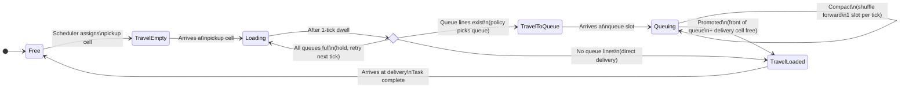
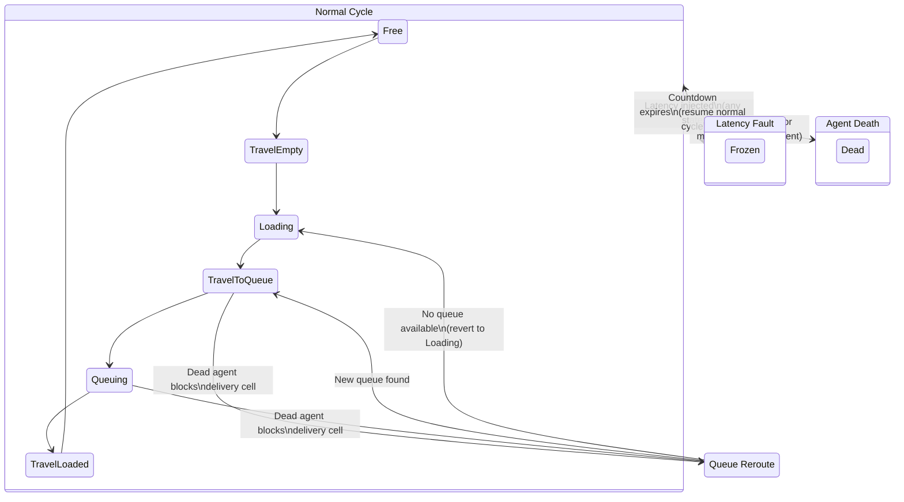

# Task Lifecycle

How agents pick up and deliver items in MAFIS.

Every agent cycles through a series of **task legs** — states that describe what the agent is currently doing. The cycle repeats indefinitely: pick up cargo, travel to delivery, drop it off, get a new assignment.

---

## States

| State | What the agent is doing |
|-------|------------------------|
| **Free** | Idle at goal, waiting for a task assignment |
| **TravelEmpty** | Moving to a pickup cell (no cargo) |
| **Loading** | At the pickup cell, loading cargo (1-tick minimum) |
| **TravelToQueue** | Carrying cargo, moving to the back of a delivery queue |
| **Queuing** | In a queue slot, shuffling forward toward the delivery cell |
| **TravelLoaded** | Carrying cargo, moving directly to the delivery cell |
| **Unloading** | At delivery, unloading (placeholder — not currently used) |

---

## Main Cycle

This is the normal path an agent follows when everything works.

### Step by step

1. **Free -> TravelEmpty** — The task scheduler picks a pickup cell for this agent. The agent's goal is set to that cell, and the solver plans a path.

2. **TravelEmpty -> Loading** — The agent arrives at the pickup cell (`pos == goal`). It enters Loading and stays for at least 1 tick (enforced by the `just_loaded` list — the queue manager skips agents that just entered Loading).

3. **Loading -> TravelToQueue / TravelLoaded** — After the 1-tick dwell, the queue manager decides:
   - If the topology has queue lines: the queue policy picks which queue to join. The agent heads to the back of that queue.
   - If there are no queue lines: the agent goes directly to a delivery cell.
   - If all queues are full: the agent stays in Loading and retries next tick.

4. **TravelToQueue -> Queuing** — The agent arrives at its assigned queue slot. It's now physically in the queue.

5. **Queuing -> Queuing (compaction)** — When a slot ahead becomes empty, agents shuffle forward one slot per tick.

6. **Queuing -> TravelLoaded (promotion)** — When the agent reaches the front of the queue (slot 0) AND the delivery cell is free, it gets promoted. Its goal becomes the delivery cell.

7. **TravelLoaded -> Free** — The agent arrives at the delivery cell. The task is recorded as complete, and the agent becomes Free — ready for a new assignment in the same tick.

---

## Fault Interruptions

Faults can interrupt the normal cycle at any point.

### Latency fault (temporary)

A latency fault freezes the agent for N ticks. During this time:
- The agent's planned path is cleared every tick (it cannot move)
- State transitions are skipped entirely
- The agent is excluded from `used_goals` so it doesn't block task assignment for others
- When the countdown reaches 0, the agent resumes its normal cycle from wherever it was

### Agent death (permanent)

When an agent dies (Weibull overheat or manual kill):
- `alive` is set to false
- The agent's position becomes a grid obstacle
- If the agent was in a queue, it's removed from its slot
- If the dead agent blocks a delivery cell, all agents in that queue are **rerouted**

### Queue reroute (blocked delivery)

When a dead agent occupies a delivery cell, agents queuing for that delivery can't be promoted. The queue manager handles this:
- If another queue is available: the agent is rerouted to the new queue (`TravelToQueue` with a new target)
- If no queue is available: the agent reverts to `Loading` and retries next tick

When reverting to Loading, the goal is set to the original pickup cell (not the agent's current position). This prevents premature state transitions if the agent is still in a corridor.

---

## Task Schedulers

The scheduler determines how Free agents get assigned to pickup cells. MAFIS has four schedulers — each produces different spatial patterns.

| Scheduler | How it picks a cell |
|-----------|-------------------|
| **Random** | Uniform random from all pickup cells |
| **Closest** | Two-phase: random task pool + greedy nearest match |
| **Balanced** | Least-recently-used cell, tie-break by distance |
| **Roundtrip** | Prefers pickups near the delivery zone |

The **Closest** scheduler deserves a note: it does NOT assign every agent to the globally nearest pickup (which would cause all agents to converge on the same area). Instead, it creates a random pool of candidate pickups, then each agent picks the nearest one from that pool. This gives locality benefit without hotspot convergence.

---

## Timing Rules

A few timing invariants that matter for understanding simulation behavior:

| Rule | Why |
|------|-----|
| **1-tick dwell at Loading** | Enforced by `just_loaded[]` — the queue manager skips agents on the tick they enter Loading. Prevents instant Loading->TravelToQueue in the same tick. |
| **Promotion requires physical presence** | An agent must be at `pos == queue[0]` to be promoted, not just logically slotted. The solver must actually move the agent there. |
| **Completion and reassignment in same tick** | When TravelLoaded -> Free happens, the batch assignment in the same tick can immediately assign a new pickup. No wasted tick. |
| **Frozen agents excluded from used_goals** | Latency-injected agents don't block goal cells, so active agents aren't starved. |
